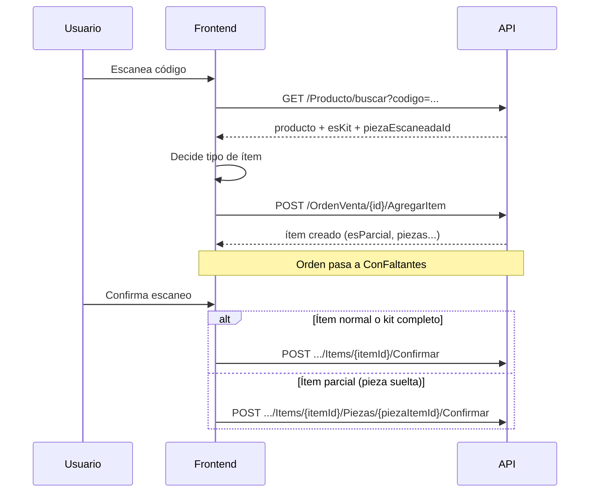

# Módulo de escaneo — Guía para frontend

Documentación para integrar el submódulo de **escaneo** (operador/cajero) con productos normales, **kits completos** y **piezas sueltas** de kit.

**Base URL:** `{API_URL}/api`  
**Autenticación:** Bearer JWT en todas las peticiones.  
**JSON:** camelCase (`idProducto`, `esKit`, etc.).

---

## 1. Flujo general



---

## 2. Cuándo se puede escanear / agregar

La orden debe estar en uno de estos estados:

| Estado orden | ¿Agregar ítem? | ¿Confirmar escaneo? |
|--------------|----------------|---------------------|
| `Lista` | Sí | Sí |
| `ConFaltantes` | Sí | Sí |
| Otros (`Pendiente`, `Aceptada`, `EsperandoPago`, etc.) | No | No |

**Roles** que pueden usar estos endpoints (según API actual):

| Endpoint | Roles |
|----------|--------|
| `GET /Producto/buscar` | Admin, Cajero, Operador |
| `POST /OrdenVenta/{id}/AgregarItem` | Operador, Admin, Cajero |
| `POST .../Confirmar` (ítem / pieza) | Operador, Admin, Cajero |
| `DELETE .../Items/{itemId}` | Operador, Admin, Cajero |
| `PUT .../Items/{itemId}/Cantidad` | Operador, Admin, Cajero |

Listar órdenes listas (GraphQL): query `OrdenesListas` (Operador, Admin).

---

## 3. Paso 1 — Resolver código escaneado

### `GET /api/Producto/buscar?codigo={codigo}`

Busca por:

- Código principal, aux o aux2 del producto
- Código universal de pieza (`P-...`)
- Formato `prefijoMarca-codigo` (ej. `ABC-12345`)

### Respuesta 200

```json
{
  "id": 45,
  "codigo": "KIT-001",
  "nombre": "Kit frenos",
  "precio": 150.00,
  "stock_Actual": 5,
  "stockReservado": 1,
  "esKit": true,
  "ubicacion": "A-12",
  "marcaId": 2,
  "prefijoMarca": "ABC",
  "piezaEscaneadaId": 8,
  "piezas": [
    {
      "id": 8,
      "codigoUniversal": "P-PASTILLA-8",
      "nombre": "Pastilla",
      "stockActual": 20,
      "stockReservado": 2,
      "cantidadPorKit": 4
    }
  ]
}
```

| Campo | Uso en front |
|--------|----------------|
| `esKit` | `false` → producto normal. `true` → kit. |
| `piezaEscaneadaId` | Solo si el código escaneado coincide con una **pieza** del kit. Si viene con valor → agregar **pieza suelta**, no kit completo. |
| `piezas` | Lista de piezas del kit (stock, códigos). `null` si no es kit. |
| `stock_Actual` / `stockReservado` | Stock del producto (kit: stock calculado del kit). Para piezas usar `stockActual` / `stockReservado` de cada entrada en `piezas`. |

### Errores

| HTTP | Body |
|------|------|
| 400 | `{ "message": "Indique un código." }` |
| 404 | `{ "message": "Producto no encontrado." }` |

---

## 4. Paso 2 — Decidir qué enviar a AgregarItem

```text
¿piezaEscaneadaId != null?
  → SÍ: agregar PIEZA SUELTA (ítem parcial)
¿esKit == true y piezaEscaneadaId == null?
  → SÍ: agregar KIT COMPLETO
¿esKit == false?
  → SÍ: agregar PRODUCTO NORMAL
```

**Importante:** Si escaneas una pieza pero solo envías `idProducto` del kit **sin** `idPieza` ni `codigoEscaneado`, el API agregará el **kit entero**, no la pieza.

---

## 5. Paso 3 — Agregar ítem a la orden

### `POST /api/OrdenVenta/{ordenId}/AgregarItem`

### Body — producto normal

```json
{
  "idProducto": 12,
  "cantidad": 1
}
```

- Reserva stock del producto.
- Crea ítem con `esParcial: false`.
- Confirmar después con `POST .../Items/{itemId}/Confirmar`.

---

### Body — kit completo

Escaneaste el **código del kit** (`piezaEscaneadaId` es `null`).

```json
{
  "idProducto": 45,
  "cantidad": 1
}
```

- Reserva stock de **cada pieza** (`cantidad × cantidadPorKit` por pieza).
- Crea ítem con `esParcial: false`.
- Confirmar con `POST .../Items/{itemId}/Confirmar` (el API descuenta todas las piezas del kit).

---

### Body — pieza suelta (recomendado)

Escaneaste código `P-...` (`piezaEscaneadaId` tiene valor).

**Opción A — con id de pieza (recomendada):**

```json
{
  "idProducto": 45,
  "idPieza": 8,
  "cantidad": 1
}
```

**Opción B — solo id de pieza:**

```json
{
  "idPieza": 8,
  "cantidad": 1
}
```

**Opción C — con código escaneado:**

```json
{
  "idProducto": 45,
  "codigoEscaneado": "P-PASTILLA-8",
  "cantidad": 1
}
```

El API detecta la pieza por `codigoEscaneado` y crea ítem **parcial**.

- Reserva solo stock de esa pieza.
- Crea ítem con `esParcial: true` y una línea en `piezas`.
- Confirmar con `POST .../Items/{itemId}/Piezas/{piezaItemId}/Confirmar` (no uses Confirmar del ítem completo).

---

### Respuesta 200

```json
{
  "id": 101,
  "idProducto": 45,
  "cantidad": 1,
  "esParcial": true,
  "precioUnitario": 150,
  "estado": "Pendiente",
  "piezas": [
    { "id": 201, "idPieza": 8, "cantidad": 1 }
  ],
  "producto": {
    "id": 45,
    "codigo": "KIT-001",
    "nombre": "Kit frenos",
    "ubicacion": "A-12",
    "esKit": true
  }
}
```

| Campo | Descripción |
|--------|-------------|
| `id` | Id del **OrdenVentaItem** (usar en confirmar / eliminar). |
| `esParcial` | `true` → confirmar por pieza. `false` → confirmar ítem. |
| `piezas[].id` | Id de **OrdenVentaItemPieza** (para `ConfirmarPieza`). |
| `piezas[].idPieza` | Id de **PiezaKit** en catálogo. |

Tras agregar, la orden pasa a **`ConFaltantes`**.

### Errores frecuentes

| HTTP | message (ejemplo) |
|------|-------------------|
| 400 | `Indique Id_Producto o Id_Pieza.` |
| 400 | `La orden no está lista para escaneo.` |
| 400 | `Stock insuficiente...` / `Stock insuficiente de {pieza} para el kit...` |
| 400 | `La pieza no pertenece a un kit.` |
| 404 | `Producto no encontrado.` / `Kit del producto no encontrado.` |

---

## 6. Paso 4 — Confirmar escaneo

### Ítem normal o kit completo (`esParcial === false`)

`POST /api/OrdenVenta/{ordenId}/Items/{itemId}/Confirmar`  
Sin body (o body vacío).

- Libera reserva y descuenta stock (producto o todas las piezas del kit).
- Estado ítem → `Confirmado`.

**No usar** si `esParcial === true` → respuesta: `Use el endpoint de piezas para ítems parciales.`

---

### Pieza suelta (`esParcial === true`)

`POST /api/OrdenVenta/{ordenId}/Items/{itemId}/Piezas/{piezaItemId}/Confirmar`

```json
{
  "precioUnitario": 37.50
}
```

- `piezaItemId` = `piezas[].id` de la respuesta de AgregarItem (no confundir con `idPieza` del catálogo).
- Estado de la línea de pieza → `Confirmado`; si todas las piezas del ítem están resueltas, el ítem puede pasar a `Confirmado`.

---

## 7. Otros endpoints útiles en escaneo

### Eliminar ítem agregado (no confirmado)

`DELETE /api/OrdenVenta/{ordenId}/Items/{itemId}`

- Libera reservas (normal, kit o pieza parcial).
- No permitido si el ítem ya está `Confirmado`.

### Cambiar cantidad (solo ítems no parciales)

`PUT /api/OrdenVenta/{ordenId}/Items/{itemId}/Cantidad`

```json
{ "cantidad": 2 }
```

- Producto normal: ajusta reserva de stock del producto.
- Kit: ajusta reserva de **cada pieza** según `cantidadPorKit`.
- **No disponible** para ítems parciales → mensaje: eliminar y volver a agregar.

### Finalizar escaneo de la orden

`POST /api/OrdenVenta/{ordenId}/Finalizar` (revisar en API si el nombre exacto es otro; en código existe lógica con estado `Lista` y ítems pendientes).

---

## 8. Estados (referencia UI)

### Orden

| Estado | UI sugerida |
|--------|-------------|
| `Lista` | Lista para escanear |
| `ConFaltantes` | Se agregó algo extra; seguir escaneando |
| `EsperandoPago` | Escaneo cerrado, espera pago |

### Ítem

| Estado | Significado |
|--------|-------------|
| `Pendiente` | Falta confirmar escaneo |
| `Confirmado` | Escaneado y stock descontado |
| `Incompleto` | Faltante (almacén) |
| `ListoIndividual` | Listo sin confirmar cajero (flujo almacén) |

---

## 9. SignalR (opcional)

Hub de ventas — eventos relevantes al agregar en escaneo:

| Evento | Cuándo |
|--------|--------|
| `NuevoItemAgregado` | Tras `AgregarItem` |
| `OrdenConFaltantes` | La orden pasó a `ConFaltantes` |
| `ItemEliminado` | Tras eliminar ítem |

Payload de `NuevoItemAgregado` incluye `ordenId`, `itemId`, `productoNombre`, `codigo`, `cantidad`, `esParcial`.

---

## 10. Tipos TypeScript (ejemplo)

```typescript
/** GET /api/Producto/buscar */
export interface ProductoBusquedaEscaneo {
  id: number;
  codigo: string;
  nombre: string;
  precio: number;
  stock_Actual: number;
  stockReservado: number;
  esKit: boolean;
  ubicacion: string;
  marcaId: number | null;
  prefijoMarca: string | null;
  piezaEscaneadaId: number | null;
  piezas: PiezaKitBusqueda[] | null;
}

export interface PiezaKitBusqueda {
  id: number;
  codigoUniversal: string;
  nombre: string;
  stockActual: number;
  stockReservado: number;
  cantidadPorKit: number;
}

/** POST /api/OrdenVenta/{id}/AgregarItem */
export interface AgregarItemOrdenRequest {
  idProducto?: number;
  idPieza?: number;
  codigoEscaneado?: string;
  cantidad: number;
}

export interface AgregarItemOrdenResponse {
  id: number;
  idProducto: number | null;
  cantidad: number;
  esParcial: boolean;
  precioUnitario: number;
  estado: string;
  piezas: { id: number; idPieza: number; cantidad: number }[] | null;
  producto: {
    id: number;
    codigo: string;
    nombre: string;
    ubicacion: string;
    esKit: boolean;
  };
}
```

---

## 11. Lógica sugerida en el front (pseudocódigo)

```typescript
async function onCodigoEscaneado(ordenId: number, codigo: string) {
  const p = await api.get<ProductoBusquedaEscaneo>(
    `/Producto/buscar?codigo=${encodeURIComponent(codigo)}`
  );

  const body: AgregarItemOrdenRequest = {
    cantidad: 1,
    codigoEscaneado: codigo.trim(),
  };

  if (p.piezaEscaneadaId != null) {
    // Pieza suelta
    body.idProducto = p.id;
    body.idPieza = p.piezaEscaneadaId;
  } else {
    // Normal o kit completo
    body.idProducto = p.id;
  }

  const item = await api.post<AgregarItemOrdenResponse>(
    `/OrdenVenta/${ordenId}/AgregarItem`,
    body
  );

  // Guardar en UI: item.id, item.esParcial, item.piezas?.[0]?.id para confirmar
  return item;
}

async function confirmarEscaneo(
  ordenId: number,
  item: AgregarItemOrdenResponse,
  precioPieza?: number
) {
  if (item.esParcial && item.piezas?.[0]) {
    await api.post(
      `/OrdenVenta/${ordenId}/Items/${item.id}/Piezas/${item.piezas[0].id}/Confirmar`,
      { precioUnitario: precioPieza ?? item.precioUnitario }
    );
  } else {
    await api.post(`/OrdenVenta/${ordenId}/Items/${item.id}/Confirmar`);
  }
}
```

---

## 12. Checklist de implementación

- [ ] Tras escanear, llamar siempre a `GET /Producto/buscar`.
- [ ] Si `piezaEscaneadaId != null`, enviar `idPieza` (o `codigoEscaneado`) en `AgregarItem`.
- [ ] Si es kit y código es del kit, solo `idProducto` + `cantidad`.
- [ ] Mostrar en UI si el ítem es parcial (`esParcial`) y qué endpoint de confirmación usar.
- [ ] No llamar `Confirmar` de ítem en ítems parciales; usar `Confirmar` de pieza.
- [ ] Manejar orden en `Lista` o `ConFaltantes` antes de agregar.
- [ ] Mostrar stock disponible: producto `stock_Actual - stockReservado`; pieza `stockActual - stockReservado`.

---

## 13. Preguntas frecuentes

**¿Puedo agregar varias piezas del mismo kit en un solo ítem parcial?**  
Cada `AgregarItem` con `idPieza` crea un ítem parcial con una pieza. Para varias piezas distintas, haz varios `AgregarItem` o usa el flujo de creación de orden con `esParcial: true` y lista de piezas (módulo caja, no escaneo).

**¿El precio de la pieza al confirmar?**  
En `ConfirmarPieza` debes enviar `precioUnitario` (puede ser el precio del kit o el que defina tu UI).

**¿GraphQL para la orden con ítems y piezas?**  
Puedes cargar la orden con proyección de `items`, `items.piezas`, `items.producto` según tu schema Hot Chocolate existente.

---

*Última actualización: alineado con `OrdenVentaController` y `ProductoController` del backend UsaAutoPartes.Api.*
